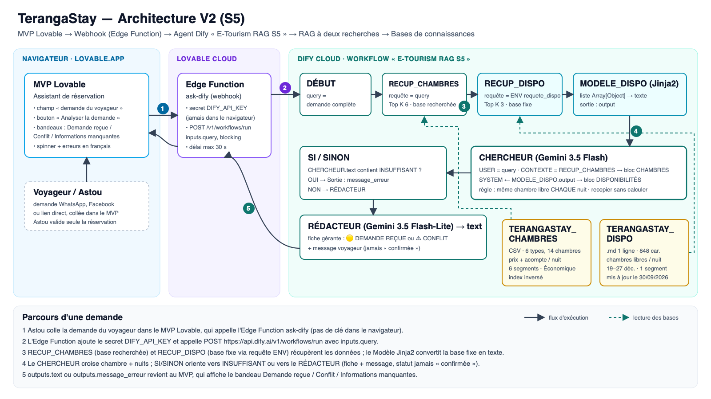

# Livrables S5 — Intégration MVP & RAG avec Dify

Séance 5 (GET 409) : connecter le MVP Lovable à l'agent Dify et ancrer ses réponses dans une base de connaissances.
À déposer sur e-Academy avant S6 (évaluation intermédiaire).

| Livrable | Contenu | Fichiers | Statut |
|----------|---------|----------|--------|
| **L1** — MVP V2 intégré en ligne (30 pts) | Assistant de réservation dans le MVP Lovable, relié au workflow Dify par une Edge Function (clé côté serveur) | [`L1-prompt-lovable-webhook.md`](L1-prompt-lovable-webhook.md) | ✅ en ligne : https://elegant-builds-studio.lovable.app (aucune clé dans le code client, vérifié) · ⏳ captures T1–T3 |
| **L2** — Pipeline RAG opérationnel (30 pts) | Bases `TERANGASTAY_CHAMBRES` + `TERANGASTAY_DISPO` indexées ; workflow « E-Tourism RAG S5 » (RAG à deux recherches) | [`../dify-s5/`](../dify-s5/README.md) · [`E-Tourism-RAG-S5.yml`](../dify-s5/E-Tourism-RAG-S5.yml) | ✅ bases indexées · ✅ workflow publié (Gemini), batterie T1–T6 6/6 · ⏳ captures « Disponible » + canvas, URL Dify |
| **L3** — Schéma d'architecture V2 (20 pts) | MVP Lovable → Edge Function (webhook) → Agent Dify → RAG → bases de connaissances | [`L3-architecture-v2.png`](L3-architecture-v2.png) · [`L3-architecture-v2.svg`](L3-architecture-v2.svg) | ✅ |
| **L4** — Journal de prompts S5 (20 pts) | 4 prompts documentés : base RAG, Chercheur, webhook Lovable, test de cohérence | [`L4-journal-prompts-s5.md`](L4-journal-prompts-s5.md) | ✅ rédigé · ✅ résultats T1–T4 · ⏳ note audit /20 |
| Bonus S6 — Plan B | Réponses simulées cohérentes avec les bases, en cas de panne API | [`plan-b-demo-s6.md`](plan-b-demo-s6.md) | ✅ |

## Ordre des étapes restantes

1. ~~Dify : importer le DSL, publier, créer la clé `app-…`~~ ✅ (Groq : gpt-oss-120b / gpt-oss-20b).
2. Dify : captures des 2 bases « Disponible » et du canvas pour L2.
3. Lovable : coller le prompt de [`L1-prompt-lovable-webhook.md`](L1-prompt-lovable-webhook.md), saisir la clé dans le secret `DIFY_API_KEY`.
4. Tester T1–T3 dans le MVP, faire les captures, publier le MVP.
5. Reporter les résultats dans le journal L4, déposer L1–L4 sur e-Academy.

## Sécurité

Aucune clé n'est versionnée dans ce dépôt public. La clé `app-…` du workflow vit uniquement dans les secrets
Lovable Cloud ; la clé `dataset-…` utilisée pour créer les bases doit être supprimée après usage.
